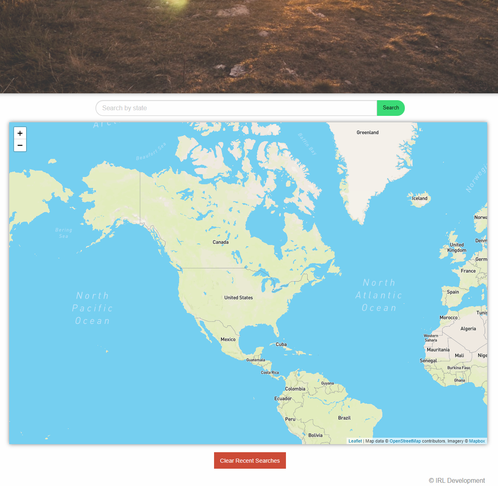

# Weather To Camp

## Description
Weather to Camp is used to show campsite locations and their weather on a map. The application uses Foundation for styling, Leaflet with MapBox for mapping, OpenWeatherMap.org API for climate conditions, and the Recreation Information Database API by Recreation.gov for the campsite locations and info. The current version of the site allows the user to filter search by state for campsites & their current weather conditions. Searches are saved to local storage but can also be cleared with the "clear recent searches" button.

## Website URL
https://rjblake88.github.io/weather-to-camp/

